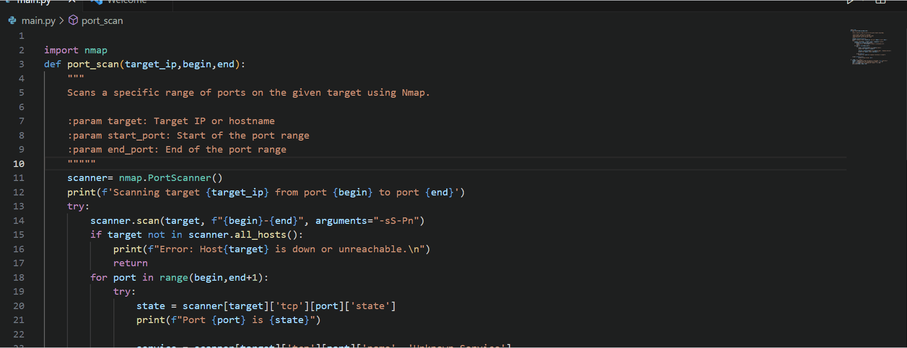

# Port Scanner Automation


A Python-based automation project to scan open ports using the Nmap module. This tool simplifies the process of identifying open ports on a network, helping you secure your system more efficiently.

---

## Features
- **Automated Port Scanning**: Scans a range of ports on a target IP address.
- **Logging**: Saves scan results to a log file for future reference.
- **Customizable**: Easily modify the port range or target IP.

---

## Demo



---

## Prerequisites
1. **Python 3.x**: Install Python from [python.org](https://www.python.org/).
2. **Nmap**: Install Nmap from [nmap.org](https://nmap.org/download.html).
3. **python-nmap**: Install the Python Nmap module using pip:
   ```bash
   pip install python-nmap
